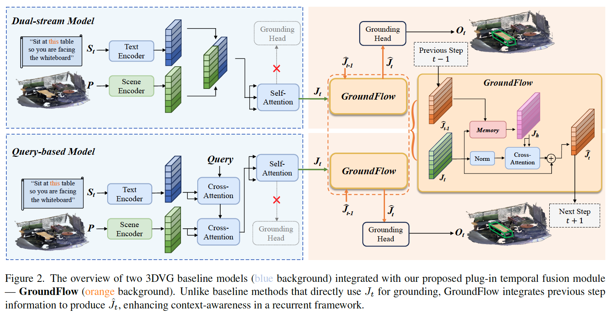
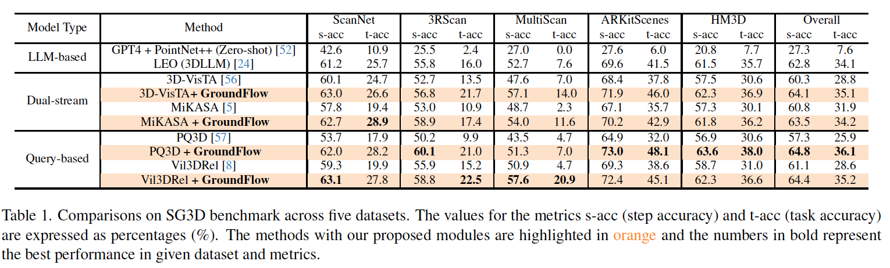
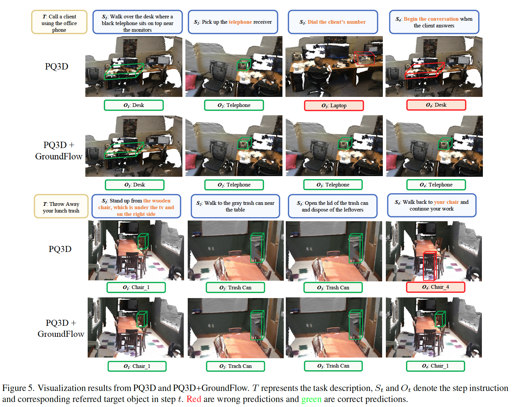
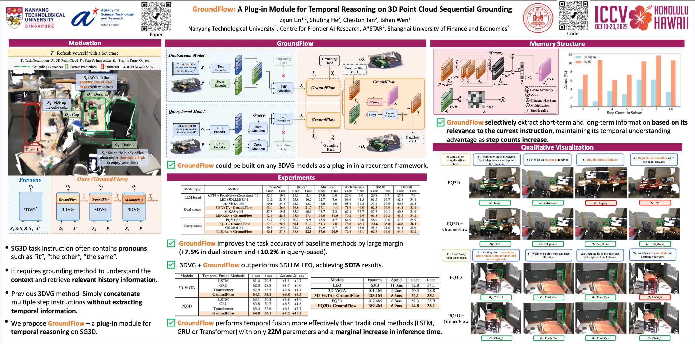

# [ICCV 2025] GroundFlow: A Plug-in Module for Temporal Reasoning on 3D Point Cloud Sequential Grounding
Paper Link: https://arxiv.org/pdf/2506.21188
## Framework

<p align="center">
  
</p>

## Prerequisite


```
conda env create --name groundflow 
pip3 install torch==2.0.0
pip3 install torchvision==0.15.1
pip3 install -r requirements.txt
```

* Please refer to [SG3D Benchmark](https://github.com/sg-3d/sg3d) to download the dataset and checkpoint. 
* Change the TBD in config to the downloaded path.

## Experimients

### 3D-VisTA
```
python3 run.py --config-path configs/vista --config-name sequential-sceneverse-single.yaml
```
### 3D-VisTA + GroundFlow
```
python3 run.py --config-path configs/vista --config-name sequential-sceneverse.yaml
```
### PQ3D
```
python3 run.py --config-path configs/query3d --config-name sequential-sceneverse-single.yaml
```
### PQ3D + GroundFlow
```
python3 run.py --config-path configs/query3d --config-name sequential-sceneverse.yaml
```

## Results
<p align="center">
  
</p>
<p align="center">
  
</p>

## ICCV Poster
<p align="center">
  
</p>

## Acknowledgments

We gratefully acknowledge the open-source projects that our work builds upon.
* [SG3D](https://github.com/sg-3d/sg3d)
* [LEO](https://github.com/embodied-generalist/embodied-generalist)
* [3D-VisTA](https://github.com/3d-vista/3D-VisTA)

✉️ Feel free to email me (zijun002@e.ntu.edu.sg) or raise the issue if you have any questions about our work.
## Citation
If you find our work useful in your research, please cite it as follows:
```
@inproceedings{GroundFlow,
  title={GroundFlow: A Plug-in Module for Temporal Reasoning on 3D Point Cloud Sequential Grounding},
  author={Lin, Zijun and He, Shuting and Tan, Cheston and Wen, Bihan},
  booktitle={IEEE/CVF International Conference on Computer Vision (ICCV)},
  year={2025}
}
```

